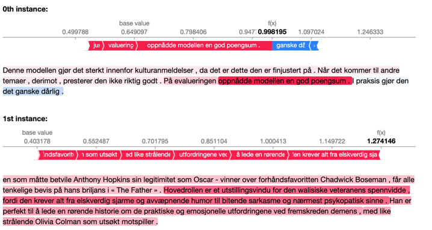

# Sentiment-Analysis-SHAP

Using Transformers + SHAP to illustrate document-level, binary sentiment analysis for Norwegian. The BERT instance is the `NbAiLab/nb-bert-base` by Nasjonalbiblioteket.

[Nasjonalbiblioteket AI Lab](https://github.com/NBAiLab)

[Transformers](https://huggingface.co/models)

[SHAP](https://shap.readthedocs.io/en/latest/index.html)

## Evaluation

When trained on ~2400 samples for 5 epochs:

| lr  | batch | f1-score on test |
| --- | ----- | ---------------- |
| 4e5 | 16    | .86              |

## SHAP illustration

Shades of red indicates positive polarity, blue for negative.

